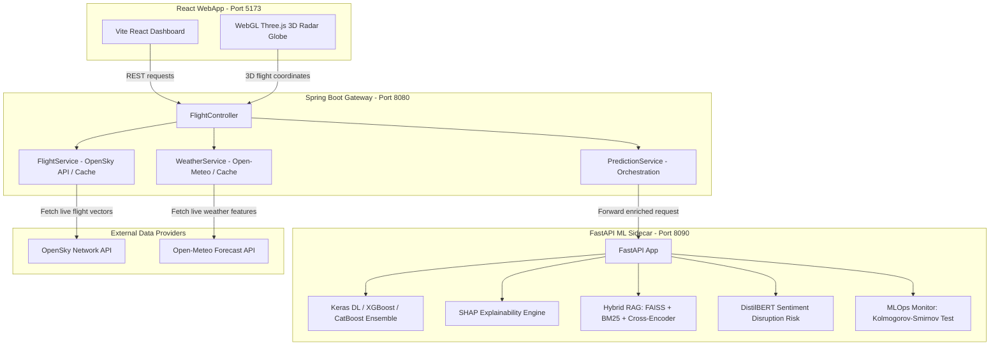

# 🛫 SkyPredict v3.0: High-Performance Airline Delay Prediction & Real-Time Analytics System

SkyPredict is a production-grade full-stack AI system built using a microservices architecture. The platform orchestrates a **Spring Boot Gateway**, a **FastAPI Machine Learning & RAG Sidecar**, and a **React + Three.js 3D WebGL Holographic Flight Radar** to predict airline flight delays, serve explainable AI insights, query legal/policy documents, and monitor model feature drift in real-time.

---

## 🏗️ System Architecture

The platform uses a decentralized microservices design, splitting business logic, API caching, model inference, and real-time WebGL rendering:



---

## 🧠 Core Subsystems

### 1. Spring Boot Gateway (Port `8080`)
* **Role:** Primary API gateway, routing controller, and client integration manager.
* **Architecture:** Formulated entirely with **Java 21** using standard Spring Web endpoints, avoiding Lombok dependencies by leveraging native Java `records` and explicit Jackson `@JsonProperty` serialization.
* **External Integration & Caching:** Interacts with OpenSky (flight state vectors) and Open-Meteo (forecast parameters) with built-in cache-control mechanisms to prevent rate-limiting.
* **Fail-Safe Fallbacks:** Automatically redirects to deterministic, simulated flight vectors and cached climate values if external APIs fail or timeout, ensuring high availability.

### 2. Python FastAPI ML & RAG Sidecar (Port `8090`)
* **Explainable Deep Learning Stack:**
  * **Deep Learning Classifier:** Implements a Keras Sequential Neural Network optimized via early-stopping and Dropout layers.
  * **Fallback Neural Network:** Implements an MLP Classifier (`scikit-learn`) as an active fallback to ensure high-performance execution across heterogeneous CPU/GPU environments.
  * **Boosting Ensemble:** Combines CatBoost and XGBoost classifiers. Loads feature mappings to inject historical route and airline delay coefficients during single-row inference.
* **Real-time Explainable AI (XAI):**
  * Synthesizes local feature attributions using **SHAP (SHapley Additive exPlanations)**. Calculates the directional push (+/- impact) of each schedule, length, or weather feature, displaying it in the dashboard UI.
* **Transformer-based Disruption Sentiment Analyzer:**
  * Integrates a fine-tuned **DistilBERT** model to classify unstructured text comments and notes. High negative sentiment score scales operational risk multipliers automatically.
* **MLOps Drift Detection:**
  * Employs the **Kolmogorov-Smirnov two-sample test (`scipy.stats.ks_2samp`)** to compare numerical distribution shifts in incoming production requests (`Time`, `Length`, `DayOfWeek`) against the baseline training dataset.
* **Advanced Hybrid RAG Chatbot:**
  * **Retrieval Strategy:** Reciprocal Rank Fusion (RRF) combining dense search (**FAISS** vector store using `all-MiniLM-L6-v2` embeddings) and sparse keyword search (**BM25**).
  * **Reranking:** Passes retrieved candidates through a **Cross-Encoder** (`ms-marco-MiniLM-L-6-v2`) to filter out irrelevant contexts.
  * **Generation:** Generates answers locally using the instruction-tuned **SmolLM-135M** model.
  * **Dynamic Indexing:** Supports real-time PDF/TXT uploads, splitting documents and indexing them into the vector space on the fly.

### 3. WebGL Holographic 3D Globe Radar (React + Three.js)
* Renders a glowing Earth wireframe sphere with orbital camera navigation, avoiding large texture assets by drawing a high-fidelity equirectangular continental outline on an in-memory `CanvasTexture` dynamically.
* Projects aircraft latitude/longitude vectors into 3D spherical positions (`x`, `y`, `z`) and aligns 3D cone meshes to normals and headings.
* Incorporates raycasting mouse collision for flight detail tooltips.
* Generates glowing **3D Quadratic Bezier curves** between flight origin and destination airports upon selection, complete with camera glide transitions.

---

## 📂 Project Structure

```
SkyPredict-Airline-Delay-Prediction/
│
├── backend/                  # Python FastAPI ML Sidecar Service (Port 8090)
│   ├── docs/                 # RAG knowledge base text and policy files
│   ├── main.py               # Sidecar entrypoint, routers, and preprocessors
│   ├── model_monitor.py      # KS-test drift detection & metrics aggregator
│   ├── rag_pipeline.py       # Hybrid BM25+FAISS retriever, Cross-Encoder & LLM
│   ├── requirements.txt      # Python dependencies
│   └── Dockerfile            # Lightweight Python runtime container
│
├── springboot-backend/       # Java API Gateway Service (Port 8080)
│   ├── src/main/java/...     # Java Controllers, DTO Records, Services
│   ├── src/main/resources/   # application.properties CORS & routing configs
│   ├── pom.xml               # Maven configuration
│   └── Dockerfile            # Multi-stage Java compile & runtime container
│
├── frontend/                 # React SPA Dashboard (Port 5173)
│   ├── src/components/       # Dashboard widgets, weather cards, prediction history
│   ├── src/pages/            # Dashboard, Analytics, Radar (Three.js WebGL Globe)
│   ├── src/App.jsx           # App shell and routing
│   └── package.json          # Node dependencies
│
├── best_model.pkl            # Persistent ML Ensemble model
├── keras_model.h5            # Persistent Keras Deep Learning model
├── feature_mappings.pkl      # Pre-calculated historical airline & route rates
├── docker-compose.yml        # Multi-container cluster configuration
├── run_dev.ps1               # Local multi-service script launcher
└── README.md                 # System documentation
```

---

## 🚀 Quick Start (Local Run)

### Prerequisites
* **Java SDK 21** & **Maven**
* **Python 3.10+** (with `pip` and optionally `conda`)
* **Node.js 18+** & `npm`

### Easy Launcher (Windows PowerShell)
Run the following script at the root of the project to compile the Java code and start the sidecar, gateway, and frontend in three separate, titled console windows automatically:
```powershell
Set-ExecutionPolicy -Scope Process -ExecutionPolicy Bypass
.\run_dev.ps1
```

### Manual Service Launch

1. **Start Python ML Sidecar:**
   ```bash
   cd backend
   pip install -r requirements.txt
   # Install ML dependencies
   pip install xgboost catboost shap scipy tensorflow transformers langchain sentence-transformers langchain-huggingface langchain-community langchain-text-splitters faiss-cpu pypdf
   python main.py
   ```
   *Verify health at: `http://localhost:8090/health`*

2. **Start Spring Boot Gateway:**
   ```bash
   cd springboot-backend
   mvnw spring-boot:run
   ```
   *Verify endpoint at: `http://localhost:8080/health`*

3. **Start React Frontend:**
   ```bash
   cd frontend
   npm install
   npm run dev
   ```
   *Access dashboard at: `http://localhost:5173`*

---

## 🐳 Docker Deployment

To launch the entire containerized microservice mesh in a local production simulation, run:
```bash
docker-compose up --build
```
This boots:
1. `ml-sidecar` at `http://localhost:8090` (Fully self-contained image copying all model files, weights, and mappings).
2. `springboot-backend` at `http://localhost:8080` (Proxying prediction, chatbot, and drift tracking requests to `ml-sidecar` inside the Docker network).
3. `frontend` at `http://localhost:5173` (Accessing the gateway dynamically).

---

## ☁️ Cloud Deployment (Render / Railway)

Because the project is fully dockerized, deploying to a cloud Platform-as-a-Service (PaaS) like **Render** or **Railway** is the fastest and most reliable route. 

Deploy the services in the following order:

### 1. Python ML Sidecar (`ml-sidecar`)
* **Deployment Type:** Web Service (Private Service if supported, or public Web Service).
* **Source:** Connect your GitHub repository.
* **Build Configuration:**
  * **Build Type:** Docker
  * **Dockerfile Path:** `backend/Dockerfile`
  * **Build Context:** Project Root (`.`)
* **Environment Variables:**
  * `HOST`: `0.0.0.0`
  * `PORT`: `8090`
* **Resource Plan:** Minimum **1GB RAM** is recommended due to HuggingFace transformers (`DistilBERT`) and `FAISS` memory allocations.
* **Result:** Save the generated service URL (e.g. `https://ml-sidecar.onrender.com` or internal URL `http://ml-sidecar:8090`).

### 2. Spring Boot Gateway (`springboot-backend`)
* **Deployment Type:** Web Service (Public).
* **Source:** Connect your GitHub repository.
* **Build Configuration:**
  * **Build Type:** Docker
  * **Dockerfile Path:** `Dockerfile`
  * **Build Context:** `./springboot-backend` (or root with path specified)
* **Environment Variables:**
  * `PYTHON_ML_SERVICE_URL`: Set this to your Python ML Sidecar URL (e.g., `https://ml-sidecar.onrender.com` or `http://ml-sidecar:8090`).
  * `PORT`: `8080`
* **Result:** Save the generated gateway URL (e.g. `https://skypredict-gateway.onrender.com`).

### 3. React Frontend (`frontend`)
* **Deployment Type:** Static Site (Fastest, zero-cost static hosting) or Docker Web Service.
* **Source:** Connect your GitHub repository.
* **Build Configuration (Static Site Option):**
  * **Build Command:** `npm run build`
  * **Publish Directory:** `dist`
  * **Root Directory:** `frontend`
* **Build Configuration (Docker Option):**
  * **Build Type:** Docker
  * **Dockerfile Path:** `Dockerfile`
  * **Build Context:** `./frontend`
* **Environment Variables (Crucial for build time):**
  * `VITE_API_BASE`: Set this to your Spring Boot Gateway URL (e.g., `https://skypredict-gateway.onrender.com`). *Do not append a slash at the end.*
* **Result:** The application is live at your frontend URL (e.g. `https://skypredict.onrender.com`).


---

## 📊 Evaluation & Metrics

The baseline classifiers were trained on sequential temporal cuts of flight scheduling histories to prevent chronological leakage:
* **Stacking Classifier Ensemble:** ~72.4% ROC-AUC on class-balanced (SMOTE) validation sets.
* **Explainability (SHAP):** Features capturing departure hour peaks (`Departure_Hour`) and weather coefficients (`Wind_Speed`) show the highest influence on delay probability.
* **MLOps Drift Detection:** Running a Kolmogorov-Smirnov test on numerical features triggers warning alerts if the live distribution deviates significantly ($p < 0.05$).

<!-- Added settings credentials documentation -->
